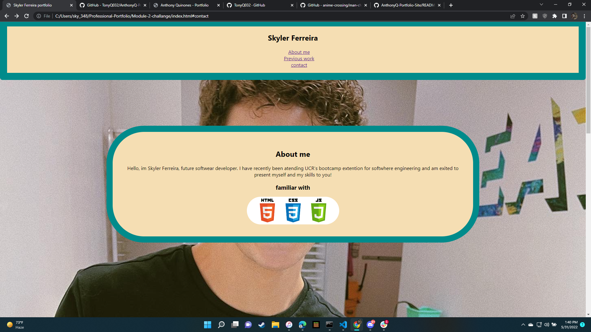

# Skyler Ferreiras Profestional Portfolio

overview

the perpose of this assighnment was to allow me to demonstrate html, css, and andvanced css skills.

this portfolio is simple but demonstrates organised styling and posibilitys of what is to come. In time i will develope my skills further and create knew webpages that will be displayed in the near future. This portfolio will continue to grow and change into the finished product that I am exited to present to you.

desktop 

tablets

smart phones

link to web page  <a href="https://sklylerf.github.io/Module-2-challange/"

link to git hub <a href="https://github.com/SklylerF/Module-2-challange/"

